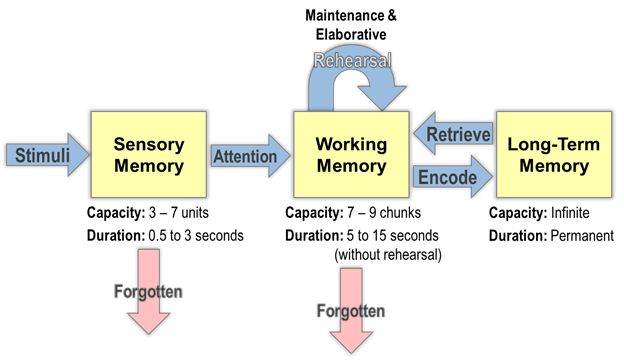

# The Missing Middle Memory

Imagine asking an AI to research the same market every Friday. The first report is useful. The second is useful too. By the sixth, something starts to feel wrong: the reports are accumulating, but the understanding keeps starting over.

A competitor changed its positioning. Two apparently independent sources turned out to be quoting the same press release. A prediction from week one failed. The system can retrieve all six reports. Can it tell you which of its beliefs should now change?

That is the memory problem I care about.

It is tempting to say humans have three layers of memory and AI has two. The familiar diagram gives us sensory memory, working memory and long-term memory:

But the analogy can mislead. A model's context window already provides an active workspace. External stores can preserve information between conversations. [MemGPT](https://arxiv.org/abs/2310.08560) explored managing different memory tiers back in 2023. We are not waiting for someone to invent a third box.

We are waiting for more systems to do the work between the boxes: comparing, revising, consolidating and forgetting. The missing middle is a responsibility as much as an architecture.

## The table between the window and the basement

Picture memory as a house at night.

There is the window, where the weather flickers against the glass. There is the kitchen table, covered in mail, receipts, books and half-formed thoughts. And there is the basement, where old boxes acquire the authority of family history.

Live retrieval is something like the window. Model weights are something like the basement. The context window gives the model a table for the current task. What happens to the arrangement when the conversation ends?

You can put everything in a box. You can photograph the table. Neither is quite the same as keeping track of what you were figuring out.

Brian Dell gets at this beautifully in [“Remembering Futures”](https://littlefutures.substack.com/p/remembering-futures): “Remembering is an act of revision.” A memory changes because of what happens after it. Yesterday's irritation becomes a pattern. A story you trusted acquires an awkward exception. Something you thought was a preference turns out to have been a passing mood.

A system that stores every observation faithfully can still fail at this. It remembers what was said while losing track of what deserves to be believed.

## Prepared understanding

The [original RAG paper](https://arxiv.org/abs/2005.11401) distinguishes knowledge held in model parameters from knowledge retrieved from an external index. That distinction explains where information comes from. It does not settle what the system should do with it over time.

A retrieved document might be yesterday's price list, an obsolete policy, an interested party's assertion or a careful synthesis of several years of evidence. All can arrive as text. They deserve different treatment.

The middle work is *prepared understanding*: an account of the world that has already been compared with earlier evidence and remains open to correction.

The phrase is ungainly, but I like that it keeps the labor visible. A good consultant's understanding of a market is prepared through repeated exposure, compression, correction and the embarrassing experience of being wrong in front of clients. It is not the number of PDFs in the folder.

Return to the weekly market report. Suppose a supplier announces a price cut. The system records the source and date, checks which products it covers, and updates the claim that this supplier is the expensive option. But an existing customer says their renewal price has risen. That should create a distinction—new-customer pricing versus renewal pricing—rather than a fight over which sentence to delete.

Next Friday, the system should bring that distinction to the question. It should also know what would settle it: an applicable quote, contract or current price sheet.

The work has accumulated. The next answer starts somewhere better.

## Search can supply the evidence

Microsoft's [GraphRAG](https://www.microsoft.com/en-us/research/project/graphrag/) offers one useful precedent. It extracts relationships and builds summaries over a corpus, preparing structure before the next question arrives. This makes different questions possible from simply retrieving the nearest passages.

But prepared structure and maintained belief are different promises. A graph can be beautifully organized and out of date. A summary can preserve a contradiction or silently erase it. Refreshing the index does not tell you which interpretation should be withdrawn.

That distinction matters for anyone building a brand brain, a research observatory or a personal assistant. You can start with a few Markdown files. You may eventually need databases, graphs and specialist retrieval. Either way, someone or something has to own the update rules.

Which observations deserve another look? Which sources are independent? When does a pattern become a claim? What could disprove it? What decision changes if it is true?

This is why I am less interested in how much a system remembers than in what it can revise.

## Memory has to forget

Brian asks another useful question: does the machine know enough to forget?

Forgetting can mean several things. A temporary plan expires. A preference is superseded. An unsupported claim loses authority. Sensitive information is deleted. An old decision remains in the record but stops governing the present.

Those are different operations. Treating all of them as “delete the memory” loses history; treating none of them as deletion makes permanent retention the default.

A useful memory needs to distinguish an observation, an interpretation and an instruction. “The customer complained about delivery” is an observation. “This account is at risk” is an interpretation. “Escalate the account” is a decision. If the system compresses all three into one confident sentence, the next agent may inherit an instruction that nobody actually gave.

The test is small enough to try. Give a system an old policy, a newer exception and a correction to that exception. Ask the same question after each update. Can it change its answer, explain why, preserve the unresolved part and stop applying the obsolete rule?

Retrieving all three documents is the beginning of that test.

## What did last week teach the system?

There are different reasons to maintain memory. A personal assistant needs to recognize that a constraint has changed without turning every passing remark into a permanent identity. A company needs to distinguish a commitment from a suggestion. A market observatory needs to notice when several apparently separate signals share one source.

None needs a perfect mechanical copy of human memory. Each needs an explicit account of what persists, who can change it and what evidence changes its authority.

The kitchen table is useful because it is a place where an arrangement can remain unfinished. You can leave two things beside each other without pretending you know how they fit. You can return tomorrow and see something different.

Perhaps that is the more demanding test for AI memory. After six weeks of work, can the system show you a belief it revised, the evidence that changed it and a decision that became better as a result?

Otherwise we have built a basement full of reports.
